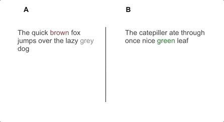
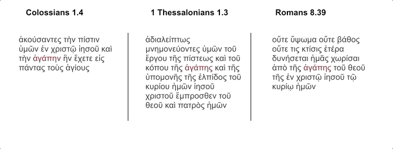

# textych

<!-- badges: start -->


<!-- badges: end -->

The goal of textych is to create interactive text parallels. This form of reference is useful for exploring similarities and differences betwixt passages. 

## Installation

You can install the released version of textych from GitHub with:

``` r
remotes::install_github("daranzolin/textych")
```
## Simple Example

Split any text into words and assign a corresponding color and tooltip.

```r
library(textych)
library(tidytext)
library(dplyr)

df <- tibble(
  text = c("The quick brown fox jumps over the lazy grey dog",
           "The catepiller ate through once nice green leaf"),
  ind = c("A", "B")
) %>% 
  unnest_tokens(word, text, to_lower = FALSE) %>% 
  mutate(
    color = case_when(
      word == "brown" ~ "brown",
      word == "grey" ~ "grey",
      word == "green" ~ "green",
      TRUE ~ "#333333"
    ),
    tooltip = case_when(
      word == "caterpillar" ~ "An insect",
      word %in% c("fox", "dog") ~ "A cute mammal",
      word == "leaf" ~ "Vegetation"
    )
  )

textych(df, text = word, text_index = ind, color = color, tooltip = tooltip)
```


## Complex Example: Greek Text Analysis

Arranging parallel texts with similar language and ideas is a common practice in textual analysis, and there is *very* expensive software that parses each word's form, tense, mood, gender, case, etc. This is a cheaper (and more customizable) alternative.

First,  I load the packages, then [retrieve and parse the texts via rperseus.](https://github.com/ropensci/rperseus)

``` r
library(rperseus) # remotes::install_github("ropensci/rperseus")
library(glue)

texts <- bind_rows(
  get_perseus_text("urn:cts:greekLit:tlg0031.tlg012.perseus-grc2", "1.4"),
  get_perseus_text("urn:cts:greekLit:tlg0031.tlg013.perseus-grc2", "1.3"),
  get_perseus_text("urn:cts:greekLit:tlg0031.tlg006.perseus-grc2", "8.39")
)

parsed_texts <- bind_rows(
  parse_excerpt("urn:cts:greekLit:tlg0031.tlg012.perseus-grc2", "1.4"),
  parse_excerpt("urn:cts:greekLit:tlg0031.tlg013.perseus-grc2", "1.3"),
  parse_excerpt("urn:cts:greekLit:tlg0031.tlg006.perseus-grc2", "8.39")
)
```

Second, I want to (1) specify title labels; (2) color the word ἀγάπη ("love"); and (3) create a custom HTML tooltip parsing each word on hover. 

``` r
tt_data <- texts %>% 
  transmute(
    text,
    passage = glue("{label} {section}")
  ) %>% 
  unnest_tokens(word, text) %>% 
  left_join(
    distinct(parsed_texts, word, form, .keep_all = TRUE), 
    by = c("word" = "form")
  ) %>% 
  mutate(color = ifelse(grepl("ἀγάπη", word), "firebrick", "#333333")) %>% 
  mutate(tooltip = glue("<table>
                              <tr>
                                  <th>word</th>
                                  <th>part</th>
                                  <th>number</th>
                                  <th>gender</th>
                                  <th>case</th>
                              </tr>
                              <tr>
                                  <td>{word.y}</td>
                                  <td>{part_of_speech}</td>
                                  <td>{number}</td>
                                  <td>{gender}</td>
                                  <td>{case}</td>
                              </tr>
                        </table>
                              ")
         )
```

Finally, I pass the data to `textych`, specifying the respective columns for each parallel, text color, and tooltip.

```r
textych(tt_data, word, passage, color, tooltip)
```


## Future work

* Highlighting words
* More easily customizable tooltips
* Additional styling
* Improved margins


